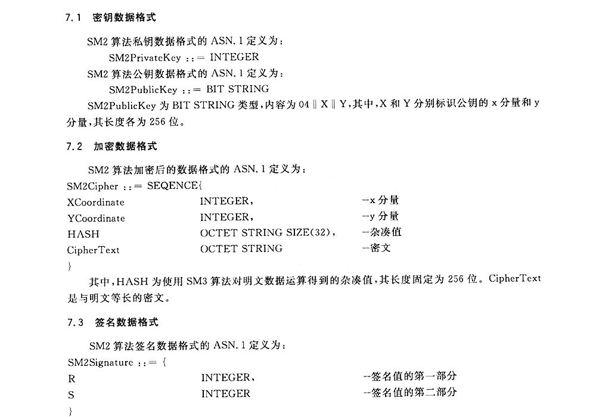
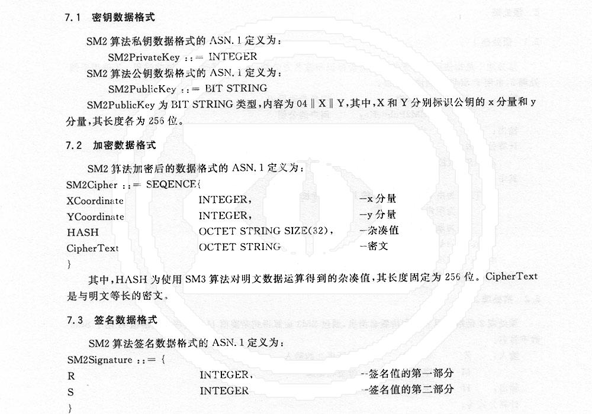

image:https://github.com/despeck/despeck/workflows/ubuntu/badge.svg["Build status (Ubuntu)", link="https://github.com/despeck/despeck/actions?workflow=ubuntu"]
image:https://badge.fury.io/rb/despeck.svg["Gem Version", link="https://badge.fury.io/rb/despeck"]

= Despeck

Remove unwanted stamps or watermarks from scanned images

`despeck` is a Ruby gem that helps you remove unwanted stamps or watermarks from
scanned images/PDFs, primarily prior to OCR.

Its image processing operations are based on `libvips` via the
https://github.com/jcupitt/ruby-vips[ruby-vips] Ruby-bindings.

It can be used to:

* detect uniform watermarks from a series of images,
* output a watermark pattern file (image, mask) that describes a watermark pattern, and
* remove a specified watermark pattern from input images regardless of the
  location of the watermark on these images.

Assumptions on input:

* The input may be a single image, or a PDF of multiple pages of images.
* In the case of multiple pages, not all pages may have the watermark.
* The input images are assumed to be purely monochrome text-based.
* The watermarks are colored. For example, if the watermark is a "`GREEN SQUARE PATTERN`", for all
  the pages that contain this mark, `despeck` will attempt to detect this pattern
  and remove them.

== Installation

=== General

Install gem manually:

[source,sh]
----
$ gem install despeck
----

Or add it to your `Gemfile`:

[source,ruby]
----
gem 'despeck'
----

and then run `bundle install`

=== OCR functions

To be able to extract text via `despeck ocr` command, you'll need to install:

* Tesseract (3.x)
* ImageMagick (6.x)
* Desired languages

==== MacOS

To install Tesseract itself (with all languages pre-installed):

[source,sh]
----
$ brew install tesseract --all-languages
----

Or you can install Tesseract with some languages manually:

[source,sh]
----
$ brew install tesseract
$ mkdir -p ~/Downloads/tessdata
$ cd ~/Downloads/tessdata
$ wget https://github.com/tesseract-ocr/tessdata/raw/3.04.00/chi_sim.traineddata
----

To install ImageMagick:

[source,sh]
----
$ brew install imagemagick@6
$ echo 'export PATH="/usr/local/opt/imagemagick@6/bin:$PATH"' >> ~/.bash_profile
$ export PKG_CONFIG_PATH=/usr/local/opt/imagemagick@6/lib/pkgconfig
----

The full list of languages trained data can be found here (note, they're different for different Tesseract versions):

https://github.com/tesseract-ocr/tesseract/wiki/Data-Files#data-files-for-version-304305

==== Ubuntu/Debian

[source,sh]
----
$ apt-get install tesseract-ocr tesseract-ocr-chi-sim imagemagick
----

==== FAQ

> **I'm getting the following error:**
>
> 'convert': No such file or directory @ rb_sysopen - /var/folders/2t/xmdrn2sd2lv2w49dv0zw9_q00000gp/T/1521805124.661379908.txt (RTesseract::ConversionError)

*This error means you don't have the appropriate Tesseract language installed (or Tesseract is unable to find that language). See language installation instructions above.*

== Usage (Command Line)

Getting actual help:

[source,sh]
----
# To show general help
despeck -h
despeck remove -h
despeck ocr -h
despeck despeck -h
----

=== All-in-one (aka Despeck)

If you need to remove watermark and extract OCR text, you may want to use:

[source,sh]
----
$ bundle exec despeck despeck -l chi_sim input.jpg
----

This is the same as two following commands:

[source,sh]
----
$ bundle exec despeck remove input.jpg output.jpg
$ bundle exec despeck ocr -l chi_sim output.jpg
----

=== Remove watermark

To remove watermark:

[source,sh]
----
$ despeck remove /path/to/input.jpg /path/to/output.jpg
----

With the command above, Despeck will try to find the watermark colour, and apply best filter settings to remove the watermark. It may be wrong, so you can pass several parameters to help Despeck with that:

[source,sh]
----
$ despeck remove --color 00FF00 --sensitivity 120 --black-const -60 --add-contrast /path/to/input.pdf /path/to/output.pdf
----

A lit of available options:

* `--color 00FF00` - to say watermark is ~ green.
* `--sensitivity 120` - increases sensitivity (if with default 100 watermark is still visible).
* `--black-const -60` - by default, Despeck tries to improve text quality by increasing black by -110. This may be too much for you, so you can reduce that number.
* `--add-contrast` - disabled by default, increases output image's contrast.
* `--accurate` - disabled by default. Applies filters to the area with watermark only, preserving the rest of the image untouched.
* `--debug` - shows debug information during command execution.

==== "Accurate" option

By default, `despeck` applies colour filters to the entire image and tries to improve the quality of the image by increasing contrast and cleaning the image.

It may decrease the original image quality in some cases, so there is the `--accurate` option, which forces `despeck` to apply `despeck` filters only to the area where watermark was found, leaving the rest of the image intact.

For example:

===== Original image

===== Despecked with default options

===== Despecked with --accurate option

== Usage

*(still under development)*

[source,ruby]
----
wr = Despeck::WatermarkRemover.new(black_const: -90, resize: 0.01)
# => #<Despeck::WatermarkRemover:0x007f935b5a1a68 @add_contrast=true, @black_const=-110, @watermark_color=nil, @resize=0.1, @sensitivity=100>
image = Vips::Image.new_from_file("/path/to/image.jpg")
# => #<Image 4816x6900 uchar, 3 bands, srgb>
output_image = wr.remove_watermark(image)
# => #<Image 4816x6900 float, 3 bands, b-w>
output_image.write_to_file('/path/to/output.jpg')
----
